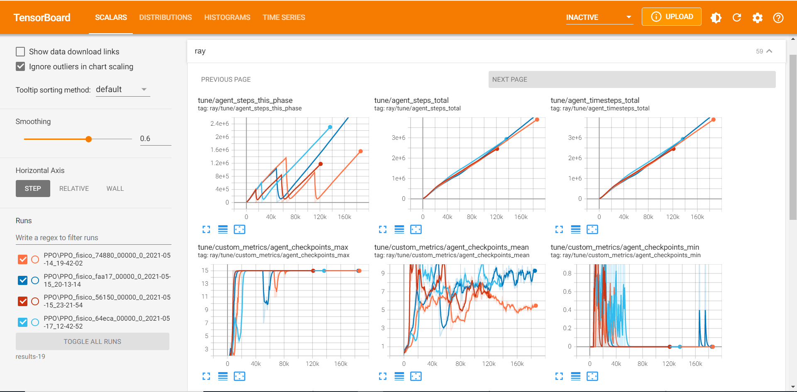

# Projeto Físico

Para rodar o arquivo "train_rllib.py", é necessário instalar a versão 0.20 do `mlagents`.
No PC do Turing:

```bash
# Instala as bibliotecas necessárias
sudo apt update
sudo apt install cmake
pip install gym ray[rllib] mlagents==0.20 torch

# Baixa o arquivo do jogo
pip install gdown
gdown --id 15ocBljC4BKiquJfQ3nCg49ZEoqyVZUm1 --output CarAgentRL.tar.gz
tar xf CarAgentRL.tar.gz

# Roda o treinamento
python src/train_rllib.py -f CarAgentRL/CarAgentRL
```


### Visualização
Existem atualmente duas formas de visualizar os resultados do treinamento: TensorBoard e plot_results.py.

#### Tensorboard
Para utilizar essa ferramenta, é necessário possuir a biblioteca tensorflow instalada. Em seguida, execute o seguinte comando para executá-la e visualizar o treinamento:

```bash
tensorboard --log-dir=<path/do/treinamento>
```

Para exemplificar, tomemos como base a estrutura abaixo:

```
results-19  
│
└───PPO
    │
    ├───PPO_fisico_64eca_...
    ├───PPO_fisico_56150_...
    ├───PPO_fisico_74880_...
    └───PPO_fisico_faa17_...
```

Executando o seguinte comando, abrirá o tensorboard com esses 4 experimentos:

```bash
tensorboard --log-dir=results-19
```



Podemos observar 4 cores diferentes nas curvas de cada gráfico, indicando os 4 experimentos distintos realizados.

#### plot_results.py

Dentro da pasta src, existe um código chamado "plot_results.py". Essa função apresenta diversos parâmetros que serão explicados abaixo:

- EXPERIMENT : Path para o experimento. Único parâmetro obrigatório dessa função.
- --no-phase : Remove a informação do nível (dificuldade do jogo) nos gráficos. Opcional.
- --no-noise : Remove ruído nas colunas de 'hist_stats'. Opcional.
- --window (-w) : Tamanho da janela para média móvel. Opcional, valor padrão igual a 10.
- --dpi : DPI da figura gerada. Opcional, valor padrão igual a 120.
- --no-default-columns : Não gera gráficos das colunas padrão. Opcional.
- --column : Colunas adicionais para gerar o gráfico. Opcional.

Execução do código:

```bash
python plot_results.py <path/do/experimento> 
```